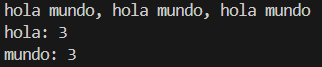

# Contando palabras

Crea un programa que cuente cuantas veces se repite cada palabra y que muestre el recuento final de todas ellas.
- Los signos de puntuación no forman parte de la palabra.
- Una palabra es la misma aunque aparezca en mayúsculas y minúsculas.
- No se pueden utilizar funciones propias del lenguaje que lo resuelvan automáticamente.

#

Create a program that counts how many times each word is repeated and displays the final count of all of them.
- Punctuation marks are not part of the word.
- A word is considered the same regardless of whether it appears in uppercase or lowercase.
- Built-in language functions that automatically solve the problem cannot be used.

## Output


## Instalación y ejecución
1. Clona el respoitorio (si no lo has clonado ya antes con algún otro ejercicio, si ya lo has clonado ve directo al paso 3):
   ```
   https://github.com/arnaunin/Retos_programacion_mouredev_2023.git
   ```
2. Instala las dependencias necesarias (si las hay):
   ```
   pip install -r requirements.txt
   ```
3. Navega hasta el ejercicio en cuestión:
   ```
   cd path_to_repository/
   ```
4. Ejecuta el proyecto:
   ```
   python contando_palabras.py
   ```
   o
   ```
   python3 contando_palabras.py
