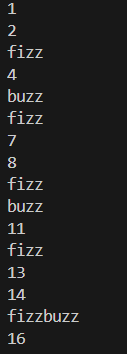

# El famoso "FIZZ BUZZ"

Escribe un programa que muestre por consola (con un print) los números de 1 a 100 (ambos incluidos y con un salto de línea entre cada impresión), sustituyendo los siguientes:

- Múltiplos de 3 por la palabra "fizz".
- Múltiplos de 5 por la palabra "buzz".
- Múltiplos de 3 y de 5 a la vez por la palabra "fizzbuzz".

#

Write a program that prints the numbers from 1 to 100 (inclusive, with a line break between each print) to the console using print, replacing the following:

- Multiples of 3 with the word "fizz".
- Multiples of 5 with the word "buzz".
- Multiples of both 3 and 5 with the word "fizzbuzz".

  ## Example Output



## Instalación y ejecución
1. Clona el respoitorio (si no lo has clonado ya antes con algún otro ejercicio, si ya lo has clonado ve directo al paso 3):
   ```
   https://github.com/arnaunin/Retos_programacion_mouredev_2023.git
   ```
2. Instala las dependencias necesarias (si las hay):
   ```
   pip install -r requirements.txt
   ```
3. Navega hasta el ejercicio en cuestión:
   ```
   cd path_to_repository/
   ```
4. Ejecuta el proyecto:
   ```
   python fizz_buzz.py
   ```
   o
   ```
   python3 fizz_buzz.py
   ```


