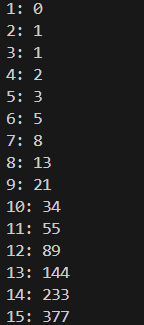

# La sucesión de Fibonacci

 Escribe un programa que imprima los 50 primeros números de la sucesión de Fibonacci empezando en 0.
- La serie Fibonacci se compone por una sucesión de números en la que el siguiente siempre es la suma de los dos anteriores.
- 0, 1, 1, 2, 3, 5, 8, 13...

#

Write a program that prints the first 50 numbers of the Fibonacci sequence starting from 0.
- The Fibonacci series consists of a sequence of numbers where the next one is always the sum of the previous two.
- 0, 1, 1, 2, 3, 5, 8, 13...

  ## Example Output



## Instalación y ejecución
1. Clona el respoitorio (si no lo has clonado ya antes con algún otro ejercicio, si ya lo has clonado ve directo al paso 3):
   ```
   https://github.com/arnaunin/Retos_programacion_mouredev_2023.git
   ```
2. Instala las dependencias necesarias (si las hay):
   ```
   pip install -r requirements.txt
   ```
3. Navega hasta el ejercicio en cuestión:
   ```
   cd path_to_repository/
   ```
4. Ejecuta el proyecto:
   ```
   python fibonacci.py
   ```
   o
   ```
   python3 fibonacci.py
   ```


