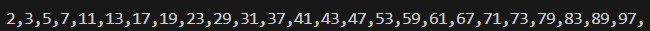

# La sucesión de Fibonacci

Escribe un programa que se encargue de comprobar si un número es o no primo.
Hecho esto, imprime los números primos entre 1 y 100.

#

Write a program that checks whether a number is prime or not.
Once done, print the prime numbers between 1 and 100.

## Output



## Instalación y ejecución
1. Clona el respoitorio (si no lo has clonado ya antes con algún otro ejercicio, si ya lo has clonado ve directo al paso 3):
   ```
   https://github.com/arnaunin/Retos_programacion_mouredev_2023.git
   ```
2. Instala las dependencias necesarias (si las hay):
   ```
   pip install -r requirements.txt
   ```
3. Navega hasta el ejercicio en cuestión:
   ```
   cd path_to_repository/
   ```
4. Ejecuta el proyecto:
   ```
   python numeros_primos.py
   ```
   o
   ```
   python3 numeros_primos.py
   ```


